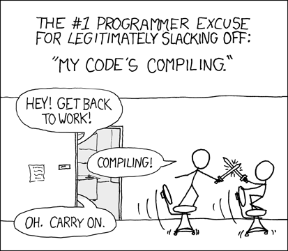

[<=== Back](../README.md)

## [Java Basics](https://docs.oracle.com/javase/tutorial/java/nutsandbolts/index.html)

### Variables

In Java, objects store their state in *fields* - fields variables that are declared as members of a class.

Types of variables:
- **Instance Variables (Non-Static Fields)**: declared without the `static` keyword. They are unique to each instance of a class. 
- **Class Variables (Static Fields)**: declared with the `static` modifier. A single instance of a variable. Used with the `final` keyword, indicates that the value of the variable will not change.
- **Local Variables**: Only visible to the methods in which they are declared, and not accessible from the rest of the class.
- **Parameters**: Always classified as *variables*, not *fields* 

### Naming

Variable names in Java:
  - Case sensitive
  - Must begin with a letter
  - While technically 'legal', do not use `$` or `_`
  - Must not contain white space
  - Must not be a keyword or reserved word

# Compiling

### ["What does it mean to compile code?"](https://www.reddit.com/r/explainlikeimfive/comments/233dq5/eli5_what_does_it_mean_to_compile_code/)

Simply put, to 'compile' code, means to convert the code from the coding language (Java, JavaScript, C#, etc) into machine language (binary). 

***Reference:***

### [Reading Java Documentation](https://www.dummies.com/category/articles/java-33602/)

